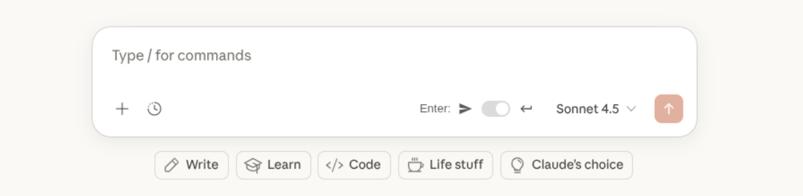

# AI Chat Enter Option Chrome Extension

This Chrome extension adds an option to Gemini, ChatGPT, and Claude to use the Enter key to:

- add a new line (and Shift+Enter to submit the prompt)
- submit the prompt (and Shift+Enter to add a new line)

## Installation

1. Clone the repository
2. Open Chrome and navigate to `chrome://extensions`
3. Enable "Developer mode"
4. Click "Load unpacked"
5. Select the cloned repository directory

## UI

### Gemini

### ChatGPT

### Claude

## Icon

## License

MIT License
